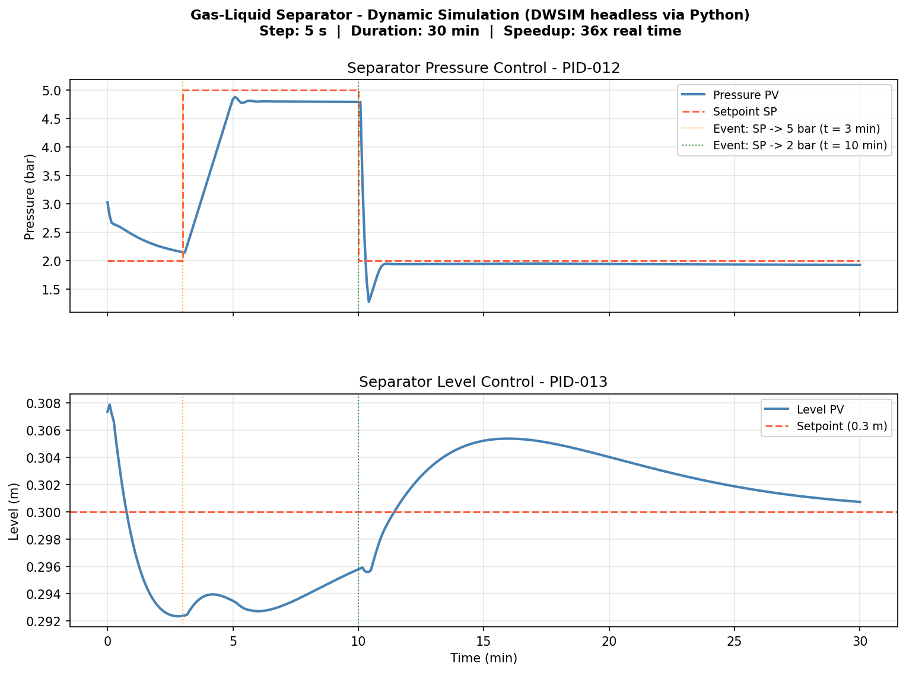

# DWSIM Dynamic Simulation with Python

Automating process dynamic simulations from Python using the DWSIM Automation API and `pythonnet`.

This repository contains a series of case studies demonstrating how to drive DWSIM dynamic flowsheets programmatically — without the GUI. Each case is self-contained and builds on the same core pattern: load a simulation, run a dynamic scenario, record the results, compare control strategies.

---

## Why scripted dynamic simulation?

Running a dynamic simulation from the DWSIM GUI is straightforward for interactive exploration. It becomes limiting when the goal is to repeat the same scenario many times, run structured what-if studies, generate datasets, or connect the simulation to a larger computational workflow.

Once a dynamic flowsheet can be controlled from Python, it becomes a reproducible process scenario. The same model can be used to run parameter sweeps, test different control strategies, generate training datasets, or evaluate how the system responds to structured disturbances — all without touching the GUI.

---

## 01 · Gas-Liquid Separator

**File:** `Dynamic Simulation - Separator Pressure and Level Control.dwxmz` (DWSIM built-in sample)  
**Property package:** Raoult's Law  
**Compounds:** Air, CO₂, Water, Methanol

### Flowsheet

```
Feed ──► FV-01 ──► SG-01 ──► PV-01 ──► gas outlet
                      │
                      └──► LV-01 ──► liquid outlet
```

### Control structure

| Controller | CV | MV | SP |
|---|---|---|---|
| PID-012 | Separator pressure | PV-01 opening | 2 bar |
| PID-013 | Separator liquid level | LV-01 opening | 0.3 m |

### Scenario

A 30-minute dynamic run with two scheduled pressure setpoint changes:
- t = 3 min → SP steps to 5 bar
- t = 10 min → SP returns to 2 bar

### Contents

```
01_separator/
├── dwsim_separator_dynamic_control.ipynb   ← main notebook
└── separator_python_run.csv                ← recorded time series
```

### Results

The 30-minute scenario runs in approximately 50 seconds — around 36× faster than real time.



### Key findings

| Topic | Correct pattern | Common mistake |
|---|---|---|
| Dynamic solver | `DWSIMSolver.SolveFlowsheet(fs, 1)` | `RequestCalculationAndWait` (runs SS solver) |
| Schedule execution | Reproduce events manually in Python | `dm.RunSchedule()` (GUI-only, raises error headless) |
| Event trigger time | `ev.TimeStamp` | `ev.TriggerTime` (does not exist) |
| Event object reference | `ev.SimulationObjectID` is a GUID — needs lookup | Using as tag directly |
| PID setpoint | `pid.SetPoint` | `pid.SetPointAbs` (does not exist) |
| Monitored variable history | Not persisted in `.dwxmz` — capture in loop | Attempting to read after reload |

---

## Requirements

- [DWSIM 9.x](https://dwsim.org) installed on Windows
- Python 3.x
- `pythonnet 3.x`
- `numpy`, `pandas`, `matplotlib`

Install Python dependencies:

```bash
pip install pythonnet numpy pandas matplotlib
```

---

## Related

- [LinkedIn article series](https://www.linkedin.com) — process engineering context and discussion for each case study
- [DWSIM](https://dwsim.org) — open source process simulator

---

*DWSIM 9.0.5 · Python 3.13 · pythonnet 3.x*

